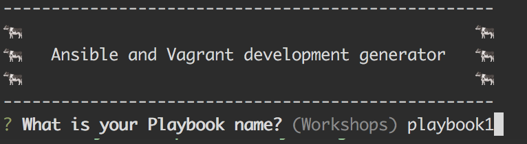
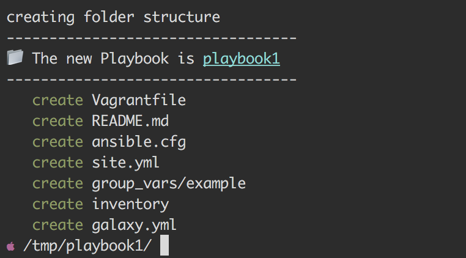
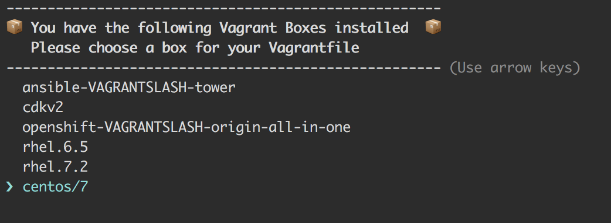
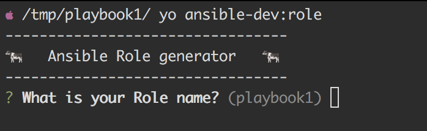
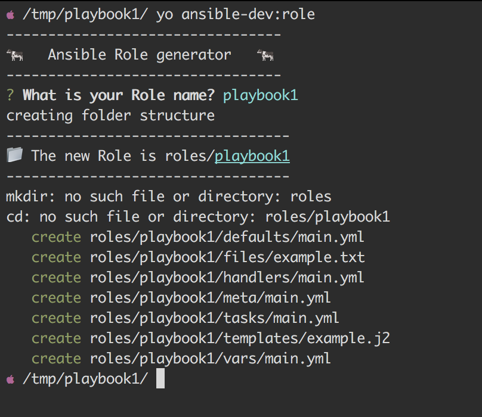

# generator-ansible-dev [![NPM version][npm-image]][npm-url] [![Build Status][travis-image]][travis-url] [![Dependency Status][daviddm-image]][daviddm-url] [![Coverage percentage][coveralls-image]][coveralls-url]
> A Yeoman generator to setup a Vagrant and Ansible development enviroment

## Installation

First, install [Yeoman](http://yeoman.io) and generator-ansible-dev using [npm](https://www.npmjs.com/) (we assume you have pre-installed [node.js](https://nodejs.org/)).

```bash
npm install -g yo
npm install -g generator-ansible-dev
```

Then generate your new Ansible Playbook:

```bash
yo ansible-dev
```






This generator will check to see what Vagrant boxes you have installed locally and present them as a list to choose from to place in your Vagrantfile. 



Then generate your new Ansible Role:

```bash
yo ansible-dev:role
```





Then start up your new Vagrant box.

```bash
vagrant up
```
To provision your Ansible role

```bash
vagrant provision
```


## Getting To Know Yeoman

 * Yeoman has a heart of gold.
 * Yeoman is a person with feelings and opinions, but is very easy to work with.
 * Yeoman can be too opinionated at times but is easily convinced not to be.
 * Feel free to [learn more about Yeoman](http://yeoman.io/).

## License

Apache-2.0 © [Stephen Sollar]()


[npm-image]: https://badge.fury.io/js/generator-ansible-dev.svg
[npm-url]: https://npmjs.org/package/generator-ansible-dev
[travis-image]: https://travis-ci.org/dischord01/generator-ansible-dev.svg?branch=master
[travis-url]: https://travis-ci.org/dischord01/generator-ansible-dev
[daviddm-image]: https://david-dm.org/dischord01/generator-ansible-dev.svg?theme=shields.io
[daviddm-url]: https://david-dm.org/dischord01/generator-ansible-dev
[coveralls-image]: https://coveralls.io/repos/dischord01/generator-ansible-dev/badge.svg
[coveralls-url]: https://coveralls.io/r/dischord01/generator-ansible-dev
